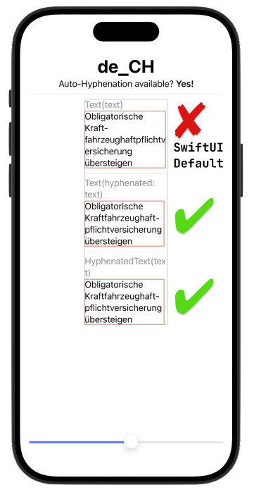

# SwiftUI-HyphenatedText

SwiftUI `Text` views can wrap text strings into multiple lines, and they look fine in English. For some reason, however, they do not follow locale conventions. This behavior is especially problematic with languages such as German.


This library leverages long existing [Core Foundation APIs](https://developer.apple.com/documentation/corefoundation/1542693-cfstringgethyphenationlocationbe) to insert [soft hyphens](https://en.wikipedia.org/wiki/Soft_hyphen) into strings. Thus, we give the text rendering system *hints* on where to hyphenate the text and insert visible hyphens.

There is built-in hyphenation support for German, French, Spanish, Italian and many other languages.



## Usage

### String Extension

You can call the `hyphenated` method on any string, optionally passing a locale to specify hyphenation conventions.

```swift
"Kraftfahrzeughaftpflichtversicherung".hypenated(locale: Locale(identifier: "de_CH"))
```
produces "Kraft•fahr•zeug•haft•pflicht•ver•si•che•rung" (the dots here represent soft hyphen characters).

### Text Extension

`Text(hyphenated: )` initializes a `Text` view with a localized and hyphenated string. The passed key will be localized during initialization according to the given locale (or by default the app's current locale), but will *not* change dynamically with the SwiftUI environment's `locale`.

```swift
Text(hyphenated: text, locale: locale)
```

### HyphenatedText (alias HText)

If you need your text to react to `locale` changes in the SwiftUI environment, use `HyphenatedText` (`HText` for short) instead.

```swift
HyphenatedText(text)
```

This library supports iOS from version 15 onwards, macOS from 12, tvOS from 15, watchOS from 8, and visionOS from version 1.